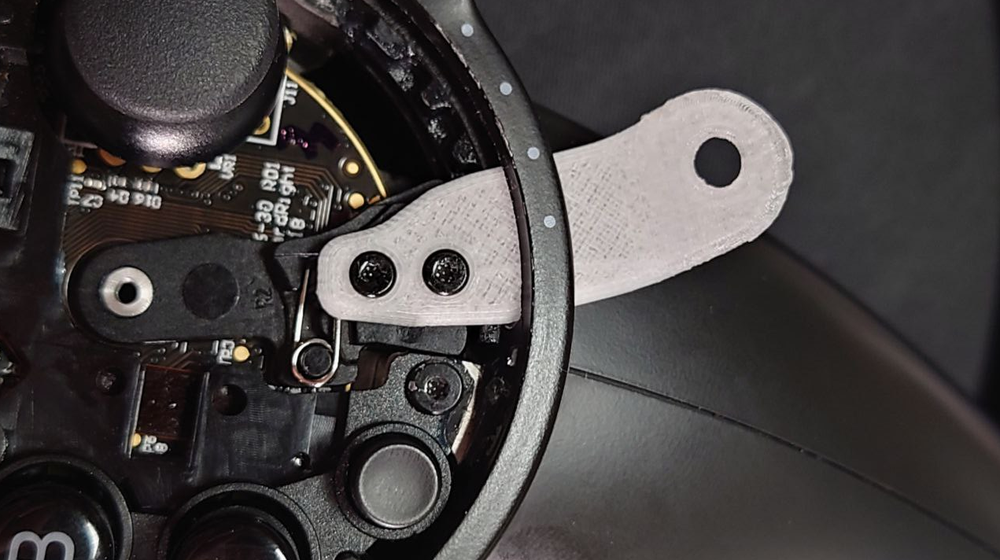

# Index-Controller-Strap
FIx your broken valve index controller strap

More photo please view below.

## Warranty
If you have warranty, I don't recommended to repair it yourself.
Opening the outside enclosure of your Steam hardware will void a warranty.

## Model
Part of this model comes from https://github.com/ValveSoftware/IndexHardware. The missing part was measured by me.

## Teardown
The strap is fixed with rivet. You need to drill the rivet with an electric drill.

## Thanks
Valve Software - Index Hardware: https://github.com/ValveSoftware/IndexHardware

## Photos

